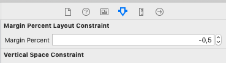

# VerticalPercentLayoutConstraint
A simple LayoutConstraint subclass to create vertical spacing between two views, based on the height of one of the elements and a given value percentage to calculate based on that height 

## Integration

#### Manually
You can manually add VerticalPercentLayoutConstraint to you project:

1. Download `VerticalPercentLayoutConstraint.swift` file,
2. Drag `VerticalPercentLayoutConstraint.swift` into you project's tree.

## Example
If you need to have a vertical space ( between two views ) to be half of the size to have the desired behaviour:

You just need to create a vertical constraint between the two. Edit that constraint an change it to a VerticalPercentLayoutConstraint's subclass and a new property will appear on the Attribuites Inspector.

Change it two half size, and it will create the desired behaviour.

## License

VerticalPercentLayoutConstraint is released under the MIT license. See LICENSE for details.
